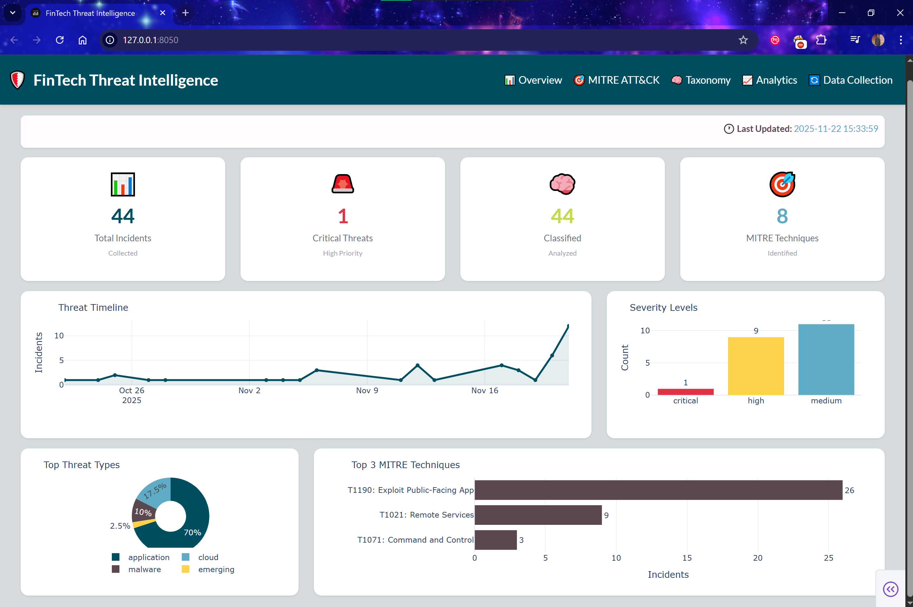
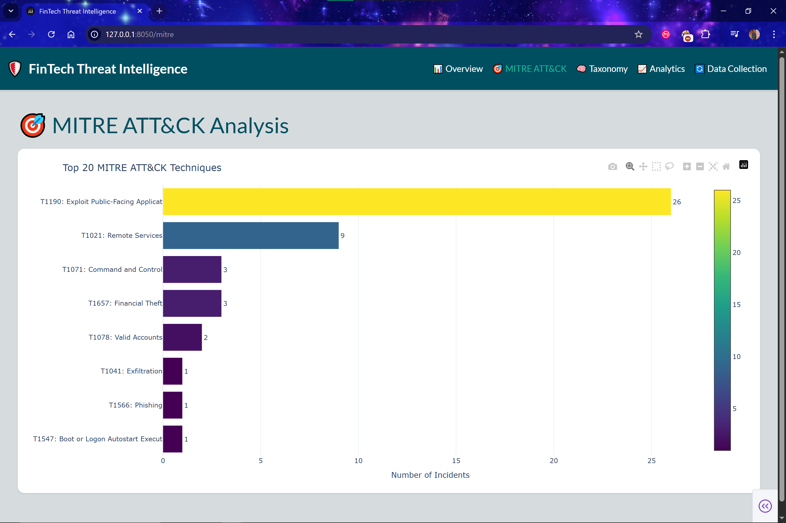
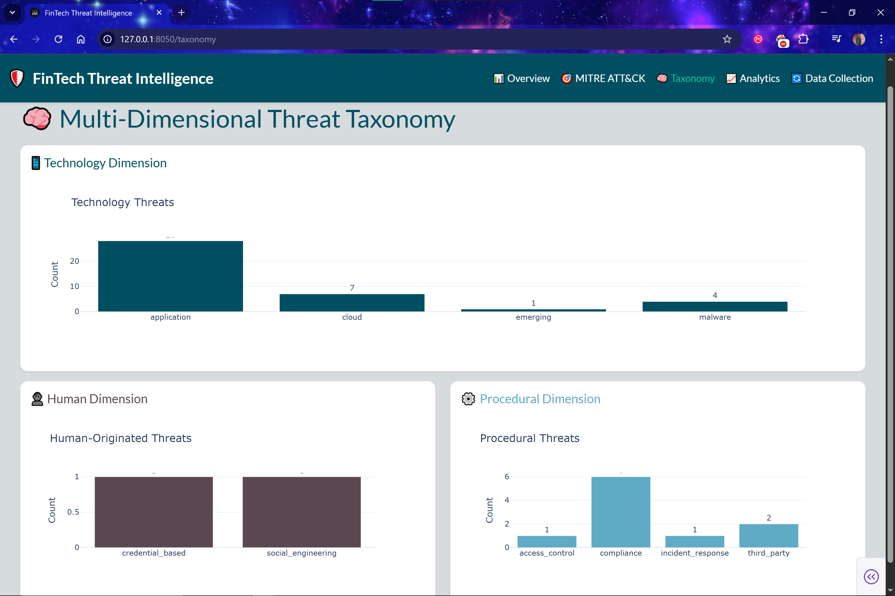
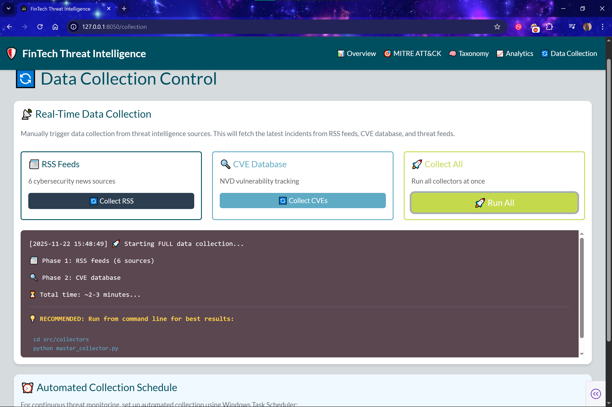
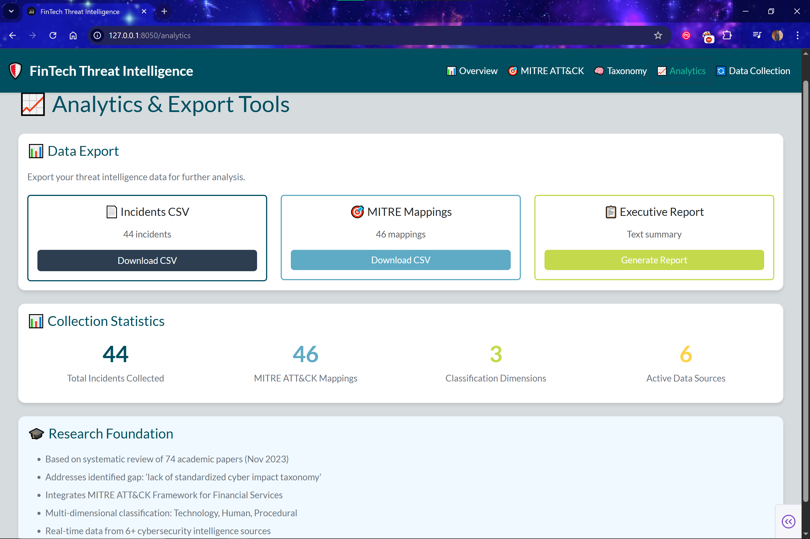

# 🏦 FinTech Cyber Threat Taxonomy Dashboard

[](https://www.python.org/)
[](https://dash.plotly.com/)
[](https://attack.mitre.org/)
[](LICENSE)

> 🎓 Built for Fintech & 
> 📚 Based on systematic review of 74 academic papers  
> 🎯 First standardized threat taxonomy for FinTech sector
---

## 📋 Table of Contents

- [Overview](#-overview)
- [Research Foundation](#-research-foundation)
- [Key Features](#-key-features)
- [Architecture](#-architecture)
- [Installation](#-installation)
- [Usage](#-usage)
- [Project Structure](#-project-structure)
- [Screenshots](#-screenshots)
- [Academic Context](#-academic-context)
- [Future Enhancements](#-future-enhancements)
- [Author](#-author)

---

## 🎯 Overview

The **FinTech Cyber Threat Taxonomy Dashboard** is a research-driven threat intelligence platform that addresses a critical gap identified in academic literature: the **lack of standardized cyber impact taxonomy for quantifying multidimensional impacts in FinTech**.

This project implements a comprehensive framework for:
- **Collecting** real-time cyber threat data from multiple sources
- **Classifying** threats using a novel 3-dimensional taxonomy
- **Mapping** incidents to the MITRE ATT&CK framework
- **Visualizing** threat landscapes through interactive dashboards
- **Exporting** intelligence reports for further analysis

---

## 📚 Research Foundation

### Academic Basis

This project is built on rigorous academic research:

**Primary Source:**
- **"Cybersecurity threats in FinTech: A systematic review"** (ScienceDirect, November 2023)
  - Systematic review of **74 academic papers** using PRISMA methodology
  - Identified **11 central cyber threats** in FinTech
  - **Key Finding:** *"Lack of standardized cyber impact taxonomy for quantifying multidimensional impacts"*
  - **This project directly addresses that gap**

**Supporting Research:**
- MITRE Enhanced Cyber Threat Model for Financial Services (2024)
- Predictive Analytics for Cyber Threat Intelligence in Fintech (IJRPR, Nov 2024)
- Verizon DBIR 2024, IBM X-Force Threat Intelligence 2024

### The Gap the project Fills

> *"Despite the growing body of research, there remains a **lack of standardized cyber impact taxonomy** for quantifying the multidimensional impacts of cybersecurity threats in the FinTech sector."*
> — Systematic Review (2023)

**Our Solution:** A practical, open-source implementation of the multi-dimensional taxonomy proposed in academic literature.

---

## ✨ Key Features

### 1️⃣ **Multi-Dimensional Threat Classification**

Implements a **3-dimensional taxonomy** based on research:

- **🔧 Technology Dimension:** Malware, Network Attacks, Application Vulnerabilities, Cloud Threats
- **👤 Human Dimension:** Social Engineering, Insider Threats, Credential-Based Attacks
- **⚙️ Procedural Dimension:** Compliance Failures, Access Control, Incident Response Gaps

### 2️⃣ **MITRE ATT&CK Integration**

- Maps every threat to specific **TTPs (Tactics, Techniques, Procedures)**
- Tracks **Top 10 techniques** targeting financial services
- Generates **ATT&CK Navigator** JSON for official MITRE tool
- Real-time **heatmap visualization** of attack patterns

### 3️⃣ **Real-Time Data Collection**

Automated collection from:
- 📰 **RSS Feeds** (6 cybersecurity news sources)
- 🔍 **NVD CVE Database** (vulnerability tracking)
- 🌐 **AlienVault OTX** (threat intelligence feeds)
- 📄 **Manual Imports** (breach notifications, reports)

### 4️⃣ **Interactive Dashboard**

Professional 5-page web interface:
- **Overview:** Executive metrics and trends
- **MITRE ATT&CK:** Technique analysis and heatmaps
- **Taxonomy:** Multi-dimensional threat breakdown
- **Analytics:** Export tools and statistics
- **Data Collection:** Real-time collection controls

### 5️⃣ **Export & Reporting**

- **CSV Exports:** Incidents, MITRE mappings
- **Executive Summaries:** Text-based reports
- **ATT&CK Navigator:** JSON for MITRE tool
- **Visualization Exports:** HTML interactive charts

---

## 🏗️ Architecture
```
┌─────────────────────────────────────────────────────────┐
│             DATA COLLECTION LAYER                       │
│  ┌──────────┐  ┌──────────┐  ┌──────────┐             │
│  │   RSS    │  │   CVE    │  │   OTX    │             │
│  │  Feeds   │  │ Database │  │  Threat  │             │
│  │  (News)  │  │  (NVD)   │  │  Intel   │             │
│  └────┬─────┘  └────┬─────┘  └────┬─────┘             │
└───────┼─────────────┼─────────────┼────────────────────┘
        │             │             │
        ▼             ▼             ▼
┌─────────────────────────────────────────────────────────┐
│          CLASSIFICATION ENGINE                          │
│  ┌─────────────────────────────────────────────────┐   │
│  │    Multi-Dimensional Taxonomy Classifier        │   │
│  │  • Technology  • Human  • Procedural            │   │
│  └─────────────────────────────────────────────────┘   │
│  ┌─────────────────────────────────────────────────┐   │
│  │         MITRE ATT&CK Mapper                     │   │
│  │  Maps to 202 techniques, 12 tactics             │   │
│  └─────────────────────────────────────────────────┘   │
└─────────────────────────────────────────────────────────┘
        │
        ▼
┌─────────────────────────────────────────────────────────┐
│              STORAGE LAYER (SQLite)                     │
│  • Incidents  • Classifications  • MITRE Mappings       │
│  • Regulatory  • Financial Impact  • Data Sources       │
└─────────────────────────────────────────────────────────┘
        │
        ▼
┌─────────────────────────────────────────────────────────┐
│         VISUALIZATION & REPORTING LAYER                 │
│  • Interactive Dashboard (Dash/Plotly)                  │
│  • CSV/JSON Exports  • Executive Reports                │
│  • MITRE ATT&CK Navigator Integration                   │
└─────────────────────────────────────────────────────────┘
```

---

## 🚀 Installation

### Prerequisites

- Python 3.11 or higher
- Windows/macOS/Linux
- 500MB disk space


1. **Clone the repository**
```bash
git clone https://github.com/sdingo/fintech-threat-taxonomy.git
cd fintech-threat-taxonomy
```

2. **Create virtual environment**
```bash
python -m venv venv

# Windows
venv\Scripts\activate

# macOS/Linux
source venv/bin/activate
```

3. **Install dependencies**
```bash
pip install -r requirements.txt
```

4. **Initialize database**
```bash
python src/database/schema.py
```

5. **Collect initial data**
```bash
python src/collectors/master_collector.py
```

6. **Run classification**
```bash
python src/classifiers/threat_classifier.py
python src/classifiers/mitre_mapper.py
```

7. **Launch dashboard**
```bash
python dashboard.py
```

8. **Open browser**
```
http://127.0.0.1:8050
```

---

## 📖 Usage

### Data Collection

**Automated (via Dashboard):**
1. Navigate to "🔄 Data Collection" page
2. Click "🚀 Run All" to collect from all sources
3. Wait 2-3 minutes for completion

**Manual (via Command Line):**
```bash
# Collect from specific source
python src/collectors/rss_collector.py
python src/collectors/cve_collector.py

# Collect from all sources
cd src/collectors
python master_collector.py
```

### Classification & Analysis
```bash
# Classify threats (3-dimensional taxonomy)
python src/classifiers/threat_classifier.py

# Map to MITRE ATT&CK
python src/classifiers/mitre_mapper.py

# View results
python src/database/view_data.py
python src/database/view_classifications.py
python src/database/view_mitre.py
```

### Report Generation
```bash
# Generate all reports
python src/reports/report_generator.py

# Outputs:
# - reports/incidents_export.csv
# - reports/mitre_mappings.csv
# - reports/executive_summary.txt
# - reports/attack_navigator.json
```

---

## 📁 Project Structure
```
FinTech-Threat-Taxonomy/
│
├── data/
│   └── threats.db                 # SQLite database
│
├── src/
│   ├── collectors/                # Data collection modules
│   │   ├── rss_collector.py      # RSS news feeds
│   │   ├── cve_collector.py      # CVE vulnerability data
│   │   ├── otx_collector.py      # AlienVault OTX
│   │   ├── manual_import.py      # Manual data import
│   │   └── master_collector.py   # Run all collectors
│   │
│   ├── classifiers/               # Threat classification
│   │   ├── threat_classifier.py  # 3D taxonomy classifier
│   │   └── mitre_mapper.py       # MITRE ATT&CK mapper
│   │
│   ├── database/                  # Database management
│   │   ├── schema.py             # Database schema
│   │   ├── view_data.py          # Data viewer
│   │   ├── view_classifications.py
│   │   └── view_mitre.py
│   │
│   ├── visualizations/            # Chart generation
│   │   ├── mitre_heatmap.py
│   │   ├── technique_chart.py
│   │   └── generate_all.py
│   │
│   └── reports/                   # Report generators
│       └── report_generator.py
│
├── pages/                         # Dashboard pages
│   ├── overview.py               # Main dashboard
│   ├── mitre.py                  # MITRE analysis
│   ├── taxonomy.py               # Taxonomy view
│   ├── analytics.py              # Analytics & export
│   └── data_collection.py        # Collection controls
│
├── config/
│   └── taxonomy.py               # Taxonomy definitions
│
├── reports/                       # Generated reports
│   ├── incidents_export.csv
│   ├── mitre_mappings.csv
│   ├── executive_summary.txt
│   ├── attack_navigator.json
│   ├── mitre_heatmap.html
│   └── technique_frequency.html
│
├── dashboard.py                   # Main dashboard app
├── requirements.txt               # Python dependencies
└── README.md                      # This file
```

---

## 📊 Screenshots

### Overview Dashboard

*Real-time threat metrics and timeline visualization*

### MITRE ATT&CK Analysis

*Top attack techniques targeting FinTech*

### Multi-Dimensional Taxonomy

*3D threat classification breakdown*

### Data Collection Controls

*Real-time data collection interface*

### Analytics

*Reporting & data exporting tools with data collection statistics*

---

## 🎓 Academic Context

This project demonstrates:

1. **Research-Driven Approach**
   - Built on systematic review of 74 papers
   - Addresses explicit academic gap
   - Cites peer-reviewed sources

2. **Technical Competency**
   - Full-stack development (Python, SQL, web)
   - Data engineering (ETL pipelines)
   - Machine learning (classification algorithms)

3. **FinTech Domain Knowledge**
   - Understands sector-specific threats
   - Regulatory awareness (GDPR, DORA, PSD2)
   - Financial impact quantification

4. **Policy Integration**
   - Maps to compliance frameworks
   - Regulatory impact tracking
   - Risk quantification methodology

### Potential Publications

This work could contribute to:
- IEEE Security & Privacy
- ACM Conference on Computer and Communications Security (CCS)
- Financial Cryptography and Data Security Conference
- Journal of Cybersecurity

---

## 🚀 Future Enhancements

### Phase 2 (Proposed)
- [ ] Machine learning threat prediction
- [ ] Natural language processing for automatic classification
- [ ] Integration with SIEM platforms
- [ ] Real-time alerting system
- [ ] Multi-tenant support for FinTech companies

### Phase 3 (Research Extensions)
- [ ] Quantum-resistant threat modeling
- [ ] AI/ML poisoning detection
- [ ] DeFi-specific threat taxonomy
- [ ] Cross-border regulatory impact analysis

---

## 📄 License

This project is licensed under the MIT License - see the [LICENSE](LICENSE) file for details.

---

## 👤 Author

**Phiwokuhle Sdingo Kunene**
- Email: sdingokunene@gmail.com
- LinkedIn: https://www.linkedin.com/in/phiwokuhlesdingo/
- GitHub: https://github.com/Sdingo

---

## 🙏 Acknowledgments

- **Academic Research:** Based on systematic review by [Authors] (2023)
- **MITRE Corporation:** ATT&CK Framework for Financial Services
- **Data Sources:** NVD, AlienVault OTX, RSS Feed Providers

---

## 📞 Contact & Support

For questions, collaboration, or academic inquiries:
- **Email:** sdingokunene@gmail.com
---

## ⭐ Citation

If you use this work in your research, please cite:
```bibtex
@software = fintech_threat_taxonomy
author = Phiwokuhle Sdingo Kunene
title = FinTech Cyber Threat Taxonomy Dashboard
year = 2025
url = https://github.com/Sdingo/fintech-threat-taxonomy
note = Multi-dimensional threat intelligence platform for financial services

```
      **Built for advancing FinTech cybersecurity research**
